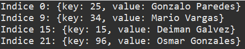
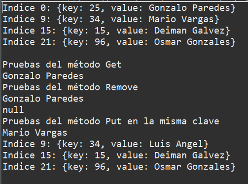
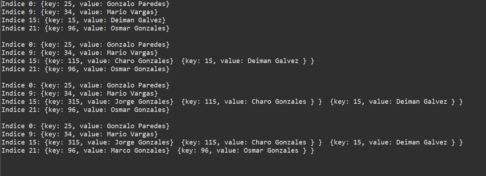
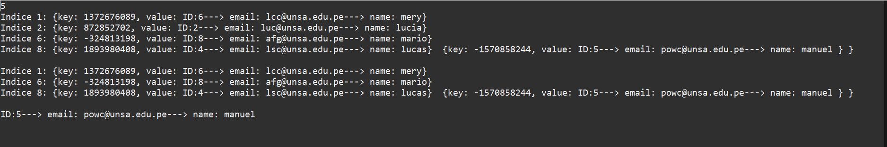

<div align="center">
<table>
    <theader>
        <tr>
            <td></td>
            <th>
                <span style="font-weight:bold;">UNIVERSIDAD NACIONAL DE SAN AGUSTIN</span><br />
                <span style="font-weight:bold;">FACULTAD DE INGENIERÍA DE PRODUCCIÓN Y SERVICIOS</span><br />
                <span style="font-weight:bold;">DEPARTAMENTO ACADÉMICO DE INGENIERÍA DE SISTEMAS E INFORMÁTICA</span><br />
                <span style="font-weight:bold;">ESCUELA PROFESIONAL DE INGENIERÍA DE SISTEMAS</span>
            </th>
            <td></td>
        </tr>
    </theader>
    <tbody>
        <tr><td colspan="3"><span style="font-weight:bold;">Formato</span>:Informe de Práctica de Laboratorio</td></tr>
        <tr><td><span style="font-weight:bold;">Aprobación</span>:  2022/03/01</td><td><span style="font-weight:bold;">Código</span>: GUIA-PRLD-001</td><td><span style="font-weight:bold;">Página</span>: 1</td></tr>
    </tbody>
</table>
</div>

<div align="center">
<span style="font-weight:bold;">INFORME DE LABORATORIO</span><br />
</div>


<table>
<theader>
<tr><th colspan="6">INFORMACIÓN BÁSICA</th></tr>
</theader>
<tbody>
<tr><td>ASIGNATURA:</td><td colspan="5">Estructura de Datos y Algoritmos</td></tr>
<tr><td>TÍTULO DE LA PRÁCTICA:</td><td colspan="5">Hash</td></tr>
<tr>
<td>NÚMERO DE PRÁCTICA:</td><td>07</td><td>AÑO LECTIVO:</td><td>2022 A</td><td>NRO. SEMESTRE:</td><td>III</td>
</tr>
<tr>
<td>FECHA DE PRESENTACIÓN:</td><td>14-Agosto-2022</td><td>HORA DE PRESENTACIÓN:</td><td colspan="3">11:30</td>
</tr>
<tr><td colspan="4">Integrantes:
        <ul>
            <li><h5>Machicao Quispe, Gabriel Steven</h5></li>
        </ul>
    </td>
    <td colspan="2">Nota:</td>
</<tr>
<tr><td colspan="6">DOCENTES:
<ul>
<li>Richart Smith Escobedo Quispe - rescobedoq@unsa.edu.pe</li>
</ul>
</td>
</<tr>
</tdbody>
</table>

<table>
    <theader>
        <tr><th colspan="6">SOLUCIÓN Y RESULTADOS</th></tr>
    </theader>
    <tbody>
        <tr><td colspan="6">I. SOLUCIÓN DE EJERCICIOS/PROBLEMAS
	    <ul>
	        <li>
		I. Implementación del HashTable<br>
		 Se uso la interfaz de HashTable dado por el docente, el cuál se edito para probarlo en el Test1.java, para integrar esta interfaz se creo la clase Hash, en dicha clase tiene los siguientes atributos:<br>
		
```java
		public class Hash implements HashTable {
	            private ListNode[] table;
	            private int count;

		   private static class ListNode {
	            	Integer key;
		    	String value;
		    	ListNode next;
		   }
	

		    public Hash() {
			table = new ListNode[32];
		    }

		public Hash(int M) {
			if (M <= 0)
				throw new IllegalArgumentException("Valor no permitido");
			table = new ListNode[M];
		}
```
Luego se implementa los métodos dado por la interfaz que los más importantes y descatados son:<br>
***a) Put***<br>
En este método como indica usa el valor del Key para buscar en el array table la posición que va ir key si esta ha sido colocado antes, en tal caso que no y ya se lleno las 3/4 partes del array se aplica el resize, sino por medio del hash, con ayuda de la key averigua que posición le corresponde en el array, se aumenta el contador y se retorna un null. 
```java
	public String put(Integer key, String value) {
		assert key != null : "The key must be non-null";
	      
	      int bucket = hash(key); 
	      
	      ListNode list = table[bucket];
	                                     
	      while (list != null) {
	            
	         if (list.key.equals(key))
	            break;
	         list = list.next;
	      }
	      
	      
	      if (list != null) {
	    	 String aux = list.value;
	         list.value = value;
	         return aux;
	      }
	      else {
	             
	         if (count >= 0.75*table.length) {
	            resize();
	            bucket = hash(key);  
	         }
	         ListNode newNode = new ListNode();
	         newNode.key = key;
	         newNode.value = value;
	         newNode.next = table[bucket];
	         table[bucket] = newNode;
	         count++;  
	      }
	      return null;
	}
```
***b) resize***<br>
En dicho método se recorre todos lo elementos del table por medio un nuevo array de ListNode, el cual duplica su tamaño, esta coloca los elementos en nuevas posiciones si estas no estan en estado null.
```java
	private void resize() {
		ListNode[] newtable = new ListNode[table.length * 2];
		for (int i = 0; i < table.length; i++) {

			ListNode list = table[i];
			while (list != null) {

				ListNode next = list.next; 

				int hash = (Math.abs(list.key.hashCode())) % newtable.length;

				list.next = newtable[hash];
				newtable[hash] = list;
				list = next; 
			}
		}
		table = newtable; 
	}
```
***c) hash***<br>
En este método se hace uso del key para transformalo en un valor que permita posicionarlo dentro de table.
```java
	private int hash(Object key) {
		return (Math.abs(key.hashCode())) % table.length;
	}
```
***d) remove***<br>
En este método se elabora un hash con la clave dandonos un valor, que se busca en el table si se encuentra y retornar el valor, esto por medio de un while y condicionales que se ven a continuación.
```java
public String remove(Object key) {
		int bucket = hash(key);
		String aux = null;

		if (table[bucket] == null) {
			return null;
		}

		if (table[bucket].key.equals(key)) {
			aux = table[bucket].value;
			table[bucket] = table[bucket].next;
			count--;
			return aux;
		}

		ListNode prev = table[bucket];
		ListNode curr = prev.next;
		while (curr != null && !curr.key.equals(key)) {
			curr = curr.next;
			prev = curr;
		}

		if (curr != null) {
			aux = prev.next.value;
			prev.next = curr.next;
			count--;
		}
		return aux;
	}
```

			
II Uso del Hash <br>
Para la primera implementación del hash se hace uso en la clase Test1.java para comprobar su funcionalidad el cual se hace uso del put y el toString dando el siguiente resultado:<br>
<br>
Como vemos estan funcionando ambos métodos y nos da detalles dec como esta posicionando los valores, ahora en la siguiente prueba se realiza pruebas con respecto al get y remove, también el put con la misma clave.<br>
<br>
En esta ocasión, como estaba previsto se hace la correcta ejecución de los métodos, no obstante el put lo que realiza es eliminar el valor que se encuentra y por último inserta el valor nuevo, este acción denomida colisión se quiere ser tratado de otra forma, el cuál se propone el encadenamiento (lista enlazada).

III Solucionando Colisiones<br>
Para visualizar mejor los resultados en el toString, se hace uso de un método de la clase integrada a Hash, y también un atributo aparte para que solucione las colisiones y permita recibir claves iguales.<br>
```java
public class Hash implements HashTable {
	private ListNode[] table;
	private int count;
	private int count2;

	private static class ListNode {
		Integer key = null;
		String value = null;
		ListNode next = null;
		ListNode nextList = null;

		public String toString() {
			return " {key: " + key + ", " + "value: " + value + " } ";
		}
	}
```

Los métodos que se alteran para que cubran las colisiones son el método put y el método toString; en el caso del put se integra una condición para cuando tenga indice o claves iguales, este permita ver si tiene un nextList, en tal caso que tenga se aplica un ciclo para poner el dato y sino solo pone el dato al final.<br>
```java
	public String put(Integer key, String value) {
		assert key != null : "The key must be non-null";

		int bucket = hash(key);

		ListNode list = table[bucket];

		while (list != null) {

			if (list.key == key) {
				break;
			}
			list = list.next;
		}
		if (list != null) {
			if (list.nextList == null) {
				ListNode aux = new ListNode();
				aux.key = list.key;
				aux.value = list.value;
				list.nextList = aux;
				count2++;
			} else {
				ListNode aux = list.nextList;
				while (aux.nextList != null)
					aux = aux.nextList;
				ListNode nuevo = new ListNode();
				nuevo.key = list.key;
				nuevo.value = list.value;
				aux.nextList = nuevo;
				count2++;

			}
			String aux = list.value;
			list.value = value;
			return aux;
		} else {
			if (count >= 0.75 * table.length) {
				resize();
				bucket = hash(key);
			}
			if (table[bucket] == null) {
				ListNode newNode = new ListNode();
				newNode.key = key;
				newNode.value = value;
				newNode.next = table[bucket];
				table[bucket] = newNode;
				count++;
				return null;
			}

			ListNode newNode = new ListNode();
			newNode.key = key;
			newNode.value = value;
			newNode.next = table[bucket];
			newNode.nextList = table[bucket];
			table[bucket] = newNode;
			count2++;

		}
		return null;
	}			
```
Luego en el toString, para que impriman más elementos en el mismo indice se pone una condicional con un ciclo, el cuál permita dectectar a los ListNode que tenga un nextList y el ciclo es para iterrar sobre esta lista.<br>
```java
	public String toString() {
		String str = "";
		for (int i = 0; i < table.length; i++) {
			if (table[i] != null) {
				str += "Indice " + i + ": " + "{" + "key: " + table[i].key + ", " + "value: " + table[i].value ;
				if (table[i].nextList != null) {
					ListNode count = table[i];
					while (count.nextList != null) {
						str += "} " + count.nextList;
						count = count.nextList;
					}
				}
				str += "}\n";
			}
		}
		return str;
	}			
```
Se realiza una prueba con el Test1.java realizando dichos procesos, mostrando el siguiente resultado:<br>
<br>
			
IV Integrando en el User<br>
Se cambia la interfaz para poder usar la clase User en los parametros y se módificas las variables para que puedan aceptar a User, y en la clase User se crea un toString con la finalidad de mostrar mejor los resultados.
***a) User***
```java
	public String toString() {
		String str = "ID:" + id + "---> email: " + email + "---> name: " + name;
		return str;
	}
```
***b) HashDemo***
En esta clase, que contiene al método main, se pone las caracteristicas de get, put y remove, aparte de un size para probar la correción de un error del contador, para visualizar el siguiente resultado:
<br>
Dando el Resultado esperado y mostrando una mayor efectividad en cuanto al uso de memoria y velocidad al momento de almacenar datos, en este tipo de estructura.
           </li>
          </ul>
          </td></tr>   
        <tr>
	    <td colspan="6">
	        V. CONCLUSIONES
                <ul dir="auto">
		    <li>
			    Como conclusión se deja en claro que el Hash es una estructura bastante util, al momento de posicionar y organizar los elementos, para que la manipulación de estos sea más efectivo y brinde un mejor uso de la memoria, mejorando también la velocidad, se puede usar distintas soluciones para las colusiones que es un problema común que tiene este tipo de estructura; por ultimo esta estructura nos muestra una manera más sencilla de poder almacenar datos grandes sin la necesidad de hacer un uso exagerado de memoria.
		    </li>
		</ul>
	    </td>
	</tr>
 </tbody>
</table>
<table>
    <tbody>
        <tr><th>RETROALIMENTACIÓN</th></tr>
    </tbody>
    <tbody>
         <tr>
	     <th><br><br><br></th>
	 </tr>
    </tbody>
</table>
<table>
    <theader>
        <tr><th>REFERENCIAS Y BIBLIOGRAFIA</th></tr>
    </theader>
    <tbody>
        <tr><td>
            <ul>
            [1] Weiss M., Data Structures & Problem Solving Using Java, 2010, Addison-Wesley.<br>
            [2] https://www.cpp.edu/~ftang/courses/CS240/lectures/hashing.htm
            </ul></td>
        </tr>
    </tbody>
</table>
